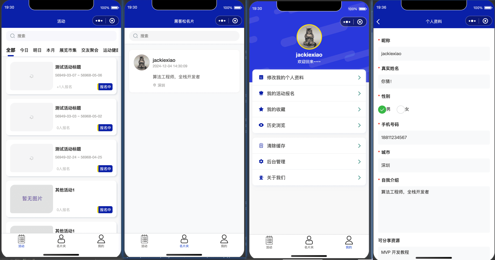
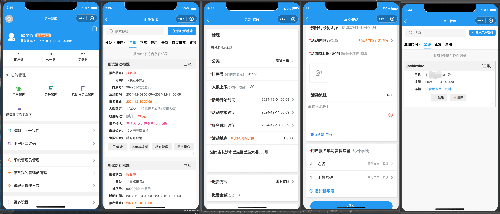
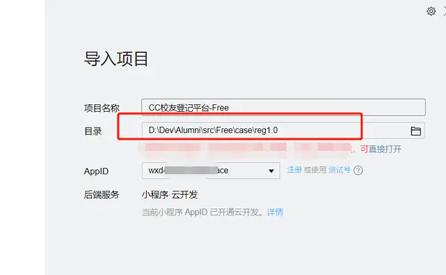
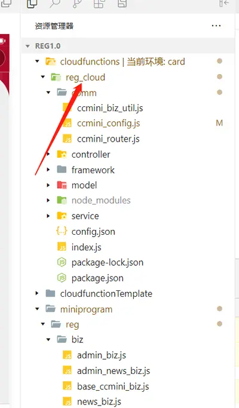
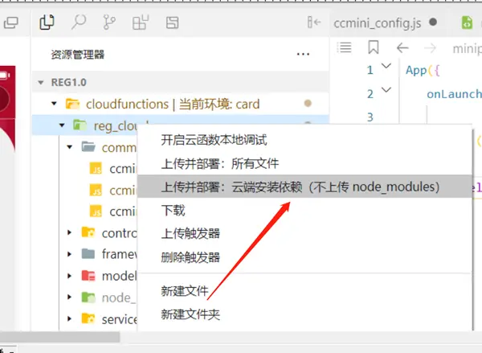

# 社区小程序 Demo
项目参考了 
https://gitee.com/minzonetech/ccreg

以及它开源的其他小程序源码， 因此 License 为 Apache License 2.0

由于原仓库的开源实际上为“残缺版”，里头的后端逻辑很多没有实现，这里使用 AI 加上了相应的逻辑，但还是有不少 bug。

## 部署教程

### 0. 了解小程序云开发的基础知识
参考微信小程序官方文档：
https://developers.weixin.qq.com/miniprogram/dev/wxcloud/basis/getting-started.html
https://developers.weixin.qq.com/miniprogram/dev/wxcloud/quick-start/miniprogram.html

### 1 源码导入微信开发者工具

### 2 开通云开发环境
参考微信官方文档：https://developers.weixin.qq.com/miniprogram/dev/wxcloud/basis/getting-started.html
在使用云开发能力之前，需要先开通云开发。

在开发者工具的工具栏左侧，点击 “云开发” 按钮即可打开云控制台，根据提示开通云开发，并且创建一个新的云开发环境。 输入图片说明

每个环境相互隔离，拥有唯一的环境 ID(拷贝此ID，后面配置用到)，包含独立的数据库实例、存储空间、云函数配置等资源；

### 3 云函数及配置
本项目使用到了一个云函数 m_cloud 

打开cloudfunctions/m_cloud/config/config.js文件，配置后台管理员账号和密码

### 4 客户端配置
打开miniprogram/app.js文件，配置环境ID (env_id)

### 5 上传云函数&指定云环境ID

### 6 云函数配置
在微信开发者工具-》云开发-》云函数-》对指定的函数添加环境变量
[服务端时间时区TZ] =>Asia/Shanghai
[函数内存] =>128M
[函数超时时间] => 20秒 输入图片说明
